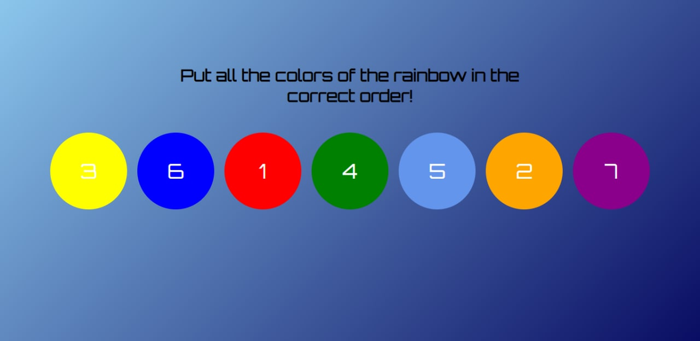

# Задача

Необходимо разработать ручную сортировку элементов массива (Drag and drop) на примере цветов радуги, для того чтобы мы могли вручную изменять порядок расположения ее цветов. Сортировать нужно исходный массив со следующими ключами: id, order(порядок), number(номер) и color(цвет).
Нужный массив находится исходниках в папке: /design/array.json.

Ссылка на шрифты: https://fonts.google.com/specimen/Orbitron

Макет:

После перемещения элемента, его позиция должна сохраниться в соответствующей ячейке.

Результат выполнения задания нужно поместить в github репозиторий.

Запуск проекта:

- npm i
- npm start

